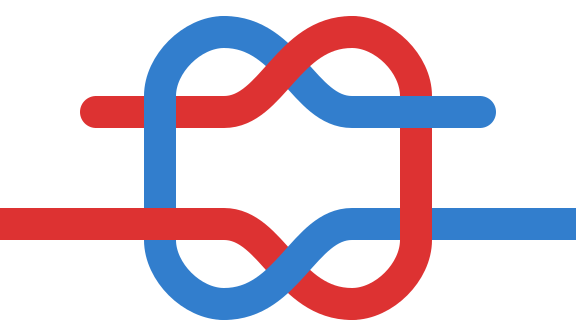
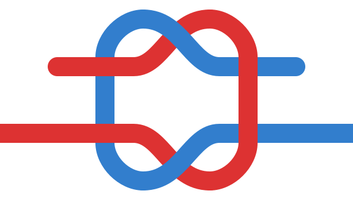

export const frontmatter = {
  title: "Knot Right",
  date: "2019-02-02",
  description: "You’ve probably been tying your shoelaces wrong.",
  unsplashPhoto: "https://images.unsplash.com/photo-1451195090173-2e0781d7c33e",
  unsplashPhotoLink: "https://unsplash.com/photos/-yz22gsqAH0",
  unsplashPhotoAuthor: "Robert Zunikoff",
}

I learned to tie my shoelaces when I was about six years old. It wasn’t until 22 years later that I discovered I’d been tying them wrong.

When you tie your shoelaces, do the ends neatly lay flat across your shoes like you expect? Or does the knot sort of turn, causing the ends to awkwardly stick up and lay more parallel to your shoes? If it’s the latter, congratulations, you’ve been tying them wrong too.

The knot for your shoelaces is called… the [shoelace knot][shoelace]. It’s made in two stages, each of which is another type of knot. The first stage is a half-hitch. The second stage is another half-hitch, but with the loops tucked into it, which is called a double-slip knot.

When you tie a half-hitch, you can choose for the lace in the left hand to go over the right, or for the lace in the right hand to go over the left—it doesn’t matter.

However, when you tie a second half-hitch over the first, which lace is on top _does_ matter. It might seem like a small difference but it’s important enough that each way has its own distinct name.

If you put the lace in the same hand on top in both half-hitch knots you will tie a [granny knot][granny].

The granny knot causes the ends of the laces to stick out at odd angles and tends to loosen and come untied on its own.

If in the second half-hitch knot you switch which side is on top from the first half-hitch knot you will tie a [reef knot][reef].

The reef knot lays flat, stays tight, and resists coming untied.

We should tie a reef knot but people tie whatever feels natural, which could be its inferior version, the granny knot.

It felt a little uncomfortable at first, but it only took a week or two of tying my laces with intention to make it feel natural, and now I tie a reef knot every time.

[shoelace]: http://en.wikipedia.org/wiki/Shoelace_knot
[granny]: http://en.wikipedia.org/wiki/Granny_knot
[reef]: http://en.wikipedia.org/wiki/Reef_knot
